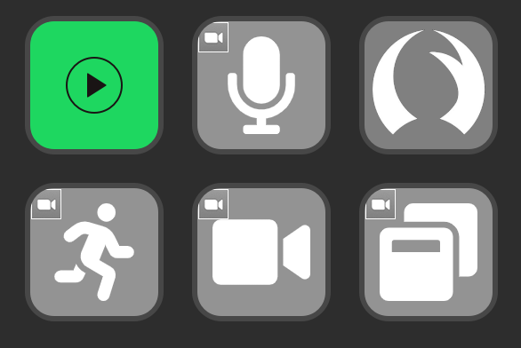
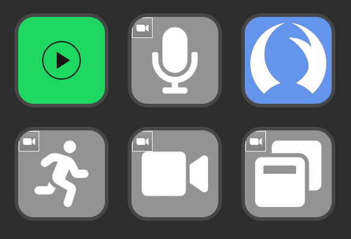

# Stream Deck Talon Plugin

A [Stream Deck](https://www.elgato.com/en/stream-deck-mini) plugin for [Talon Voice](https://talonvoice.com) that allows for easily toggling the speech engine and showing the current status.

Talon Sleep

Talon Wake

## Installing

In order to use this Stream Deck plugin, you must first copy the [Mode Saver](https://github.com/jbarr21/talon-user/tree/main/plugin/mode_saver) knausj_talon plugin into your `talon-user` config.

Then download the latest .streamDeckPlugin file and open it to install via the Stream Deck app.

## Building from source

You can build & install the plugin from source by running: `./install-from-source.sh`. Note: this script depends on [DistributionTool](https://docs.elgato.com/sdk/plugins/packaging) being on your PATH.

Logs are viewable in:
`~/streamdeck-plugin.{TODAYS_DATE_HERE}.log`
